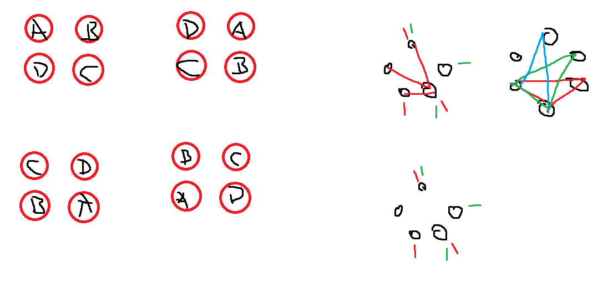

- příklady z první hodiny
	- 1b – hledáme nejtěžší minci
		- dolní odhad???
	- 1c – hledáme druhou nejtěžší minci
		- vážení po dvojicích, najdeme nejtěžší, mince, které jsme s ní porovnávali, si dáme stranou a hledáme nejtěžší mezi nimi
	- 1e – nejtěžší poštou
		- vážení každého s každým → $\frac{n^2-n}{2}$
	- 2 – průchod tunelu (12 minut)
		- 2 otec s matkou
		- 1 otec
		- 5 syn s dcerou
		- 2 matka
		- 2 otec s matkou
	- 3 – kelímkomat
		- 

## Přednáška

- prezentaci budeme mít k dispozici online, často bude rozšířená oproti přednášce, budou tam ukázkové programy
- kurz v Moodlu
- zkouška
	- společné pořadavky a zkušební termíny pro obě paralelky
	- přihlašování přes SIS
	- je nutné mít zápočet
	- povinná písemná část, nepovinná ústní
- materiály
	- Pavel Töpfer: Algoritmy a programovací techniky
	- programátorské kuchařky KSP
	- https://pruvodce.ucw.cz

### Algoritmus

- Konečná posloupnost elementárních příkazů, jejichž provádění umožňuje pro každá přípustná vstupní data mechanickým způsobem získat po konečném počtu kroků příslušná výstupní data.
- vlastnosti algoritmu – konečnost, hromadnost, resultativnost, jednoznačnost, determinismus (nebude na zkoušce :)
	- determinismus – po provedení každého kroku je jednoznačně určeno, který krok se bude provádět dále
- formální modely algoritmu – rekurzivní funkce, Turingův stroj, lambda kalkul, RAM počítač
- popis a zápis algoritmu – slovní popis v přirozeném jazyce, pseudokód, program (zjednodušená konstrukce programovacího jazyka)
- největší společný dělitel
- správnost Eukleidova algoritmu
	1. konečnost = výpočet pro jakákoliv vstupní data skončí
		- na začátku výpočtu i stále v jeho průběhu je x > 0, y > 0
		- v každém kroku výpočtu se hodnota x+y sníží alespoň o 1 -> nejpozději po x+y krocích výpočet skončí, je tedy konečný
	2. parciální správnost
- problém stabilních manželství